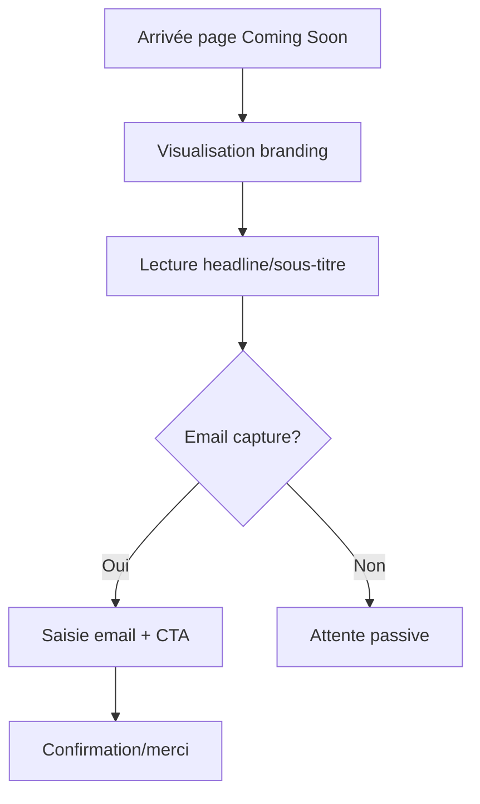

## 1. Vue d'ensemble du produit
Page "Coming Soon" premium pour cook'is - marque de cookies ultra-gourmands. Créer l'anticipation et la crédibilité de la marque avant le lancement officiel du site e-commerce.

Cible : amateurs de produits gourmands premium, early adopters, génération 25-45 ans.

## 2. Fonctionnalités principales

### 2.1 Rôles utilisateurs
Pas de distinction de rôles nécessaire pour cette page de teaser.

### 2.2 Modules de fonctionnalités
Page unique "Coming Soon" composée des modules essentiels :
1. **Section principale** : logo centré, headline, sous-titre, capture email, CTA
2. **Pied de page minimal** : copyright et mention "Cuisson en cours"

### 2.3 Détails des pages
| Page | Module | Description fonctionnelle |
|------|---------|---------------------------|
| Coming Soon | Logo cook'is | Affichage centré du logo avec apostrophe stylisée |
| Coming Soon | Headline principal | Texte dynamique parmi 3 options ("Nos cookies sont en cuisson.", "Interdit aux régimes.", "Cook'is arrive.") |
| Coming Soon | Sous-titre | Texte court créant l'anticipation |
| Coming Soon | Capture email | Input email optionnel avec micro-copy rassurant |
| Coming Soon | CTA principal | Bouton principal avec effet hover glow/scale |
| Coming Soon | Footer minimal | Texte "© cookis.fr – Cuisson en cours" |

## 3. Processus principal
L'utilisateur arrive sur la page, découvre la marque en cours de préparation, peut optionnellement laisser son email pour être informé du lancement. Aucune navigation complexe.

## 4. Interface utilisateur

### 4.1 Style de design
- **Couleurs** : Thème chocolat noir (#2C1810) OU beige gourmet (#F5E6D3)
- **Typographie** : Police premium moderne, headline 48-64px, corps 18-24px
- **Boutons** : Style arrondi avec ombres douces, effet glow au hover
- **Textures** : Grain subtil pour sensation premium
- **Animations** : Fade-in au chargement, transitions fluides

### 4.2 Vue d'ensemble du design
| Module | Éléments UI |
|--------|-------------|
| Logo cook'is | Centré, typo premium avec apostrophe stylisée, animation fade-in |
| Headline | Grande taille, graisse élevée, animation décalée |
| Email input | Bordure arrondie, placeholder élégant, micro-copy en dessous |
| CTA | Bouton principal avec gradient chocolat, effet glow/scale au hover |
| Background | Image cookie premium floutée OU texture grain subtile |

### 4.3 Responsive
Mobile-first : optimisation tactile, tailles adaptées smartphone/tablette, animations légères sur mobile pour performance.

### 4.4 Animations détaillées
- Fade-in séquentiel (logo → headline → sous-titre → CTA)
- Hover CTA : glow doré + scale 1.05
- Optionnel : animation fumée/chaleur subtile en background
- Smooth scroll si contenu dépasse viewport