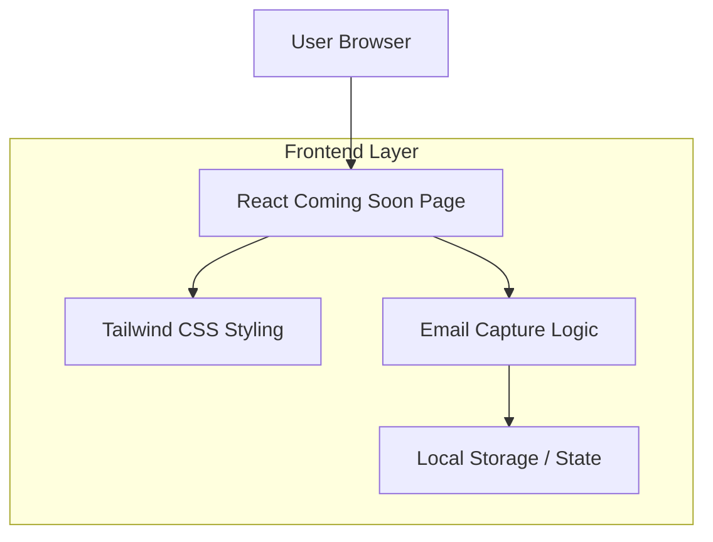

## 1. Architecture design



## 2. Description technique

- **Frontend** : React@18 + TailwindCSS@3 + Vite
- **Outil d'initialisation** : vite-init
- **Backend** : Aucun (page statique avec logique client-side)
- **Dépendances essentielles** : 
  - react@18.2.0
  - react-dom@18.2.0
  - tailwindcss@3.3.0
  - lucide-react (icônes premium)

## 3. Définitions des routes

| Route | Objectif |
|-------|----------|
| / | Page Coming Soon principale |

## 4. Structure des composants

### 4.1 Composants React

**ComingSoonPage Component**
```typescript
interface ComingSoonProps {
  theme?: 'dark-chocolate' | 'light-beige';
  copyVariant?: 'cuisson' | 'regimes' | 'arrive';
  enableEmailCapture?: boolean;
}
```

**EmailCapture Component**
```typescript
interface EmailCaptureProps {
  onSubmit: (email: string) => void;
  placeholder?: string;
  microCopy?: string;
}
```

### 4.2 Variables CSS personnalisables

```css
:root {
  /* Thème chocolat */
  --primary-chocolate: #2C1810;
  --secondary-chocolate: #8B4513;
  --accent-gold: #D4AF37;
  
  /* Thème beige */
  --primary-beige: #F5E6D3;
  --secondary-beige: #E8D5B7;
  --accent-brown: #8B4513;
  
  /* Typography */
  --font-headline: 'Playfair Display', serif;
  --font-body: 'Inter', sans-serif;
  
  /* Animations */
  --transition-smooth: all 0.3s cubic-bezier(0.4, 0, 0.2, 1);
}
```

### 4.3 Classes Tailwind personnalisées

```css
@layer utilities {
  .grain-texture {
    background-image: 
      radial-gradient(circle at 1px 1px, rgba(255,255,255,.15) 1px, transparent 0);
    background-size: 20px 20px;
  }
  
  .glow-effect {
    box-shadow: 0 0 20px rgba(212, 175, 55, 0.3);
  }
  
  .hover-lift {
    transition: transform 0.3s ease, box-shadow 0.3s ease;
  }
  
  .hover-lift:hover {
    transform: translateY(-2px) scale(1.02);
    box-shadow: 0 10px 25px rgba(0,0,0,0.15);
  }
}
```

## 5. Structure des fichiers

```
src/
├── components/
│   ├── ComingSoonPage.tsx
│   ├── EmailCapture.tsx
│   ├── CookieBackground.tsx
│   └── animations/
│       ├── FadeIn.tsx
│       └── GlowEffect.tsx
├── styles/
│   ├── globals.css
│   └── themes.css
├── utils/
│   └── copyVariants.ts
└── assets/
    └── images/
        └── cookie-placeholder.jpg
```

## 6. Performance optimisation

- Images optimisées (WebP, lazy loading)
- Animations CSS uniquement (pas de librairies lourdes)
- Code splitting automatique avec Vite
- PWA-ready pour offline